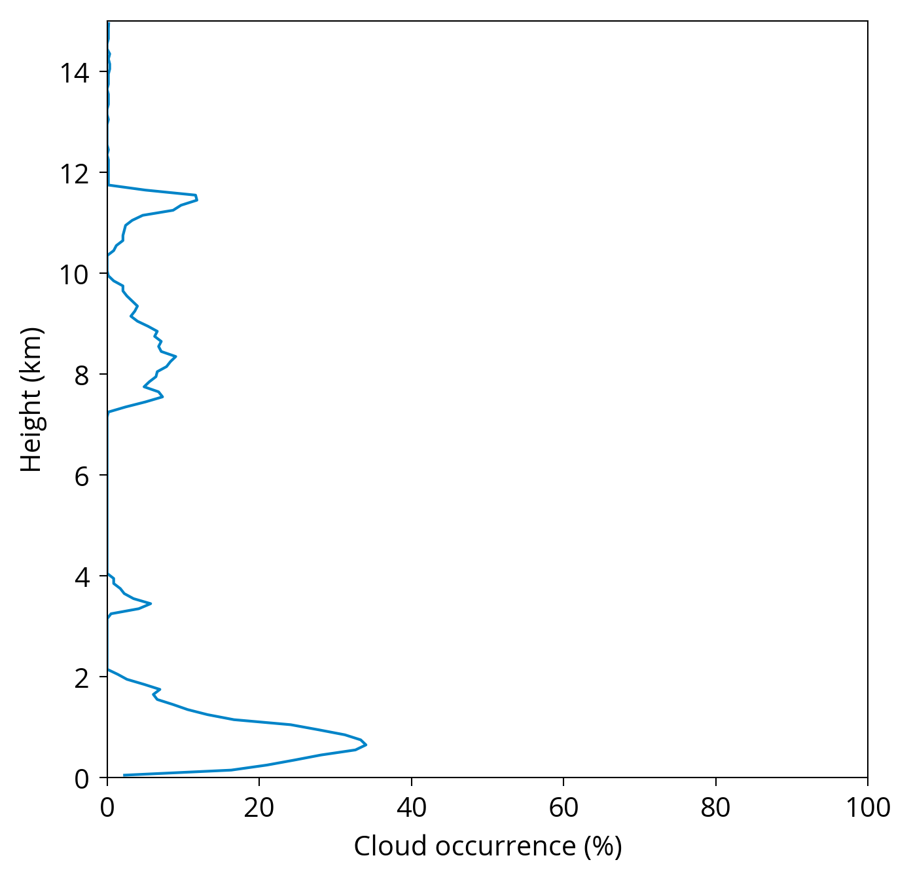

## Tutorial

This tutorial shows how to use ALCF to process ceilometer observations,
simulate lidar from model output and compare the two. As an example,
we will use 24 hours of Lufft CHM 15k ceilometer observations
at the Birdlings Flat site in Canterbury, New Zeland on 4 July 2016,
and the corresponding Antarctic Mesoscale Prediction System (AMPS)
numerical weather prediction (NWP) model and MERRA-2 renalaysis output.
To start, download the dataset archive
[alcf-tutorial-datasets.tar](https://ucliveac-my.sharepoint.com/:u:/g/personal/pku33_uclive_ac_nz/ERaql2jZmX9CtouVbz7b1m8BbKCg5juOHrWKJWipXNqR7A?e=RD62et) (4.3 GB).

**Note:** Normally, you would want to compare more than 24 hours of
measurements, such as one month or one year. This tutorial uses 24 hours of
data due to the large size of the datasets.

Processing with ALCF can be done in two modes: automatic and manual.
The automatic mode is easier and is convered in this tutorial. Both automatic
and manual processing are equivalent, but manual processing gives you a better
understanding of the processing steps and can be more useful if anything
goes wrong during the processing. Please see the
[documentation](/documentation/) on how to perform manual processing.

### Preparation

First, make sure that you have installed ALCF following the [installation
instructions]({{ site.url }}/installation), and the you can run `alcf` in the
terminal. Extract the archive `alcf-tutorial-datasets.tar` in your working
directory:

```sh
tar xf alcf-tutorial-datasets.tar
cd alcf-tutorial-datasets
```

### Datasets

The contents of the dataset archive are:

- `raw`: raw ceilometer and model files
- `raw/amps`: AMPS NWP model data
- `raw/chm15k`: Lufft CHM 15k data
- `raw/merra2`: MERRA-2 reanalysis data

The data files are stored in the NetCDF format and can be previewed
with [Panoply](https://www.giss.nasa.gov/tools/panoply/),
[HDFView](https://www.hdfgroup.org/downloads/hdfview/),
[ncdump](https://www.unidata.ucar.edu/software/netcdf/docs/netcdf_utilities_guide.html#ncdump_guide) or
[ds](https://github.com/peterkuma/ds-python).

### Automatic processing

#### Observations

To process the observations use the following command:

```sh
alcf auto lidar chm15k raw/chm15k processed/chm15k
```

This command will resample the lidar data, remove noise, detect clouds,
calculate statistics, and plot the lidar backscatter, backscatter histogram
and cloud occurrence as a function of height. The output will
be stored in `processed/chm15k`:

- `lidar`: processed lidar data as daily files (NetCDF)
- `plot`: plots
- `plot/backscatter`: daily backscatter profile plots
- `plot/backscatter_hist.png`: plot of backscatter histogram
- `plot/cloud_occurrence.png`: plot of cloud occurrence
    histogram as a function of height
- `stats`: statistics
- `stats/all.nc`: statistics (NetCDF)

Figure 1 shows the Lufft CHM 15k plots.
See [ALCF output](/documentation/alcf_output/) for description of the NetCDF
files.

<figure>
<div class="img-flex nospace">
<div><center><strong>Backscatter profile</strong></center><a href="chm15k/plot/backscatter/2016-07-04T00:00:00.png"></a></div>
<div><center><strong>Cloud occurrence</strong></center><a href="chm15k/plot/cloud_occurrence.png"></a></div>
<div><center><strong>Backscatter histogram</strong></center><a href="chm15k/plot/backscatter_hist.png"></a></div>
</div>
<figcaption><strong>Figure 1 | </strong>Lufft CHM 15k plots.</figcaption>
</figure>

#### Model

To process MERRA-2 model data use the following command:

```sh
alcf auto model merra2 chm15k raw/merra2 processed/merra2 \
    point: { 172.686 -43.821 } time: { 2016-07-04T00:00 2016-07-05T00:00 }
```

The command will extract a "curtain" of data along the give point and time
period, run the lidar simulator on the extracted data,
simulating the Lufft CHM 15k instrument, and run the same processing steps as
`alcf auto lidar` on the observational data above.
The output will be stored in `processed/merra2`:

- `model`: extracted model data along the geographical point and time period
    (NetCDF)
- `simulate`: simulated lidar backscatter (NetCDF)
- `lidar`: processed lidar data as daily files (NetCDF)
- `plot`: plots
- `plot/backscatter`: daily backscatter profile plots
- `plot/backscatter_hist.png`: plot of backscatter histogram
- `plot/cloud_occurrence.png`: plot of cloud occurrence
    histogram as a function of height
- `stats`: statistics
- `stats/all.nc`: statistics (NetCDF)

Figure 2 shows the MERRA-2 plots.
See [ALCF output](/documentation/alcf_output/) for description of the NetCDF
files.

<figure>
<div class="img-flex nospace">
<div><center><strong>Backscatter profile</strong></center><a href="merra2/plot/backscatter/2016-07-04T00:00:00.png"></a></div>
<div><center><strong>Cloud occurrence</strong></center><a href="merra2/plot/cloud_occurrence.png"></a></div>
<div><center><strong>Backscatter histogram</strong></center><a href="merra2/plot/backscatter_hist.png"></a></div>
</div>
<figcaption><strong>Figure 2 | </strong>MERRA-2 plots.</figcaption>
</figure>

#### Comparison

TODO

### Conclusion

This tutorial introduced how to use ALCF to process 24 hours of data
collected by the Lufft CHM 15k ceilometer and the corresponding data from the
MERRA-2 reanalysis. ALCF supports more advanced options described in the
[documentation]({{ "/documentation/" | relative_url }}).
For support please see the [support]({{ "/support/" | relative_url }}) page.
